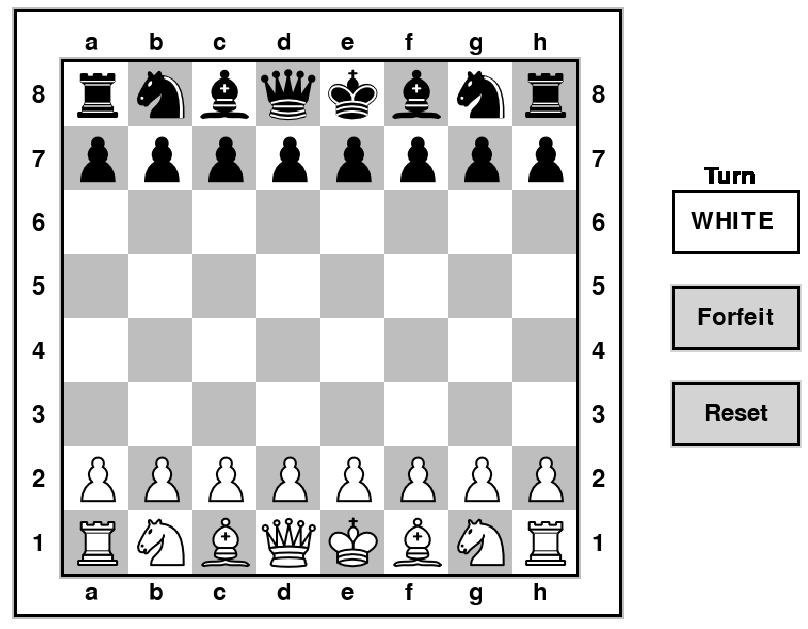

# Chess Game Variant

This repository contains classes and a graphical user interface for playing a board game that is a variant of chess. The following explanation of the rules assumes some familiarity with the rules of chess - specifically how the pieces move and capture.

The starting position for the game is the normal starting position for standard chess.

As in standard chess, white moves first. **The winner is the first player to capture all of an opponent's pieces of one type**, for example capturing all of the opponent's knights (of which there are two) would win the game, or all of the opponent's pawns (of which there are eight), or all of the opponent's kings (of which there is only one), etc. The king isn't a special piece in this game - there is no check or checkmate. Pieces move and capture the same as in standard chess, except that there is no castling, en passant, or pawn promotion. As in standard chess, each pawn can move two spaces forward on its first move (but not on subsequent moves).

Locations on the board are specified using "algebraic notation", with columns labeled a-h and rows labeled 1-8, as shown in this diagram:

**Repository contains the following files:**

ChessVar.py - Contains the logic for the chess game

ChessVarUnitTests.py - Contains unit tests for ChessVar.py

ChessGUI.py - Contains the code used to run the game in Pygame

images - Contains images used for the chess pieces in ChessGUI

&nbsp;
&nbsp;

**Running the game**

To use the graphical user interface, clone this repository and run the ChessGUI.py file in your IDE of choice.

&nbsp;
&nbsp;

**ChessVar Code Description**

**Initializing the ChessVar class**
The ChessVar class has the following data members: chessboard, piece_inventory, player_turn, and game_state.

**chessboard** is a dictionary representing the chessboard grid. The keys are the chessboard grid squares, and the values are the ChessPiece objects occupying the squares. Empty squares have values of None. This dictionary is initialized to the starting state of a normal chess game using the set_board method and will be populated by ChessPiece objects.

**piece_inventory** is a dictionary representing the piece inventory with piece names as keys and piece counts as values. It is initialized to an empty dictionary and is filled after the chessboard is set using the update_piece_inventory method. This dictionary keeps track of white and black pieces separately.

**player_turn** represents who has the current turn. Data member will either be 'WHITE' or 'BLACK' and is initialized to 'WHITE'.

**game_state** represents the status of the game. Data member is initialized to 'UNFINISHED' and will be set to 'WHITE_WON' if white makes a winning move or 'BLACK_WON' if black makes a winning move.

&nbsp;
&nbsp;

**Keeping track of turn order**

Turn order is tracked using the ChessVar player_turn data member. When a legal move is performed, make_move will call the swap_player_turn method to switch player_turn from 'WHITE' to 'BLACK' and vice versa. Swap_player_turn is not called if the proposed move is illegal.

**Keeping track of the current board position**

The current board position is tracked using the ChessVar chessboard data member. It is a dictionary where the keys are the chessboard grid squares, and the values are the ChessPiece objects occupying the squares. Empty squares have values of None. When a legal move is performed, make_move takes the source square coordinate and replaces the destination square value with the source square's value. The source square's value is then changed to None.

**Determining if a regular move is valid**

The make_move method determines if a move is valid using a variety of conditional logic. It takes the source and destination square coordinates and determines if the player is moving out of turn, if the source and destination coordinates are actually valid, and a variety of other conditions. To determine if a piece can make a certain move. The ChessPiece subclasses have their own legal_move methods. Legal_move returns True if the ChessPiece is capable of making the proposed move. After that, make_move calls a different method to determine if the proposed move would cause the chess piece to move through other pieces. The Knight is the only piece that can do this.

**Determining if a capture is valid**

A capture is valid if the proposed move is legal and if the destination square contains the opponent's piece. The Pawn legal_move method contains additional code for pawn captures since they can only capture diagonally but cannot normally move in that way.

**Determining the current state of the game**

When a legal move is made, make_move calls the update_piece_inventory dictionary which recounts the pieces left on the board. If any piece is at 0, the game_state data member is changed to the appropriate victor.